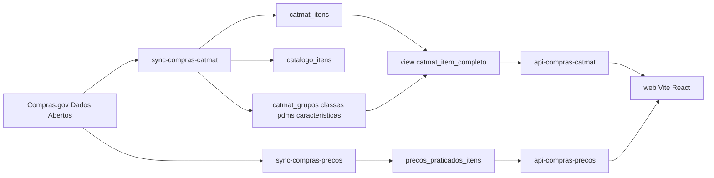

# Plano: catálogo CATMAT 7830, preços praticados e UI

O export [chat-export-1789841533769.json](C:\Users\marce\Downloads\chat-export-1789841533769.json) pede o mesmo produto do protótipo `licitagym-catmat` (hoje 401): navegar Grupo 78 → Classe 7830 → PDM → item, ver NCM/características, e consultar preços praticados no Swagger (`tipo`+`codigo`). Este repo já cobre a hierarquia e 594 itens; não tem tabela de item oficial, não persiste NCM, não tem sync de preço e não tem frontend.

**Abordagem escolhida:** dados + Edge APIs + Vite/React no mesmo repo (`web/`), lendo o banco. **Não** versionar o dump HTML do chat. **Não** scrapear todaslicitacoes / gerador de TR / alertas — o recorte do export é comparação de código item/PDM + preços + UI.

## O que já existe vs o que falta

Já no banco (inventário 2026-09-19): `catmat_grupos/classes/pdms` (49 PDMs), `catmat_item_caracteristicas` (2992), `catalogo_itens` (594, com `codigo_pdm` via [202609180012_catmat_curadoria.sql](supabase/migrations/202609180012_catmat_curadoria.sql)), PCA 7830.

Scripts **não aplicados** (drift documentado em [docs/pncp/inventario-dados.md](docs/pncp/inventario-dados.md)):

- [supabase/sql/catmat_item_completo.sql](supabase/sql/catmat_item_completo.sql) — `catmat_itens` + view consolidada
- [supabase/sql/precos_praticados.sql](supabase/sql/precos_praticados.sql) — `precos_praticados_itens`

NCM já está no DTO (`ItemMaterial.codigo_ncm` em [material-types.ts](supabase/functions/_shared/compras-gov/material-types.ts)) e **não é gravado** em [material-normalize.ts](supabase/functions/_shared/compras-gov/material-normalize.ts). Cliente de material ([material-client.ts](supabase/functions/_shared/compras-gov/material-client.ts)) não chama `/modulo-pesquisa-preco/*`.

RLS atual ([docs/pncp/security-mvp.md](docs/pncp/security-mvp.md)): `REVOKE ALL` de `anon`; SELECT só `authenticated`. A UI replica o protótipo **atrás de login Supabase**, não como site público.

## Fase 1 — Entidade item + NCM

1. Promover o SQL de `catmat_itens` e a view `catmat_item_completo` para uma migration nova (ex. `202609180019_catmat_itens.sql`). Ajustes em relação ao script:
   - `codigo_pdm` como `int` (alinhado a [202609180015_catmat_compras.sql](supabase/migrations/202609180015_catmat_compras.sql)), não `text`.
   - Bootstrap a partir de `catalogo_itens` + `catmat_item_caracteristicas` (já no script).
   - RLS SELECT `authenticated`, escrita só `service_role`.
2. Dual-write no sync: em [sync-compras-catmat/index.ts](supabase/functions/sync-compras-catmat/index.ts), após `upsertCatalogoItemFromCompras`, upsert em `catmat_itens` com hierarquia + NCM + `origem='api'`.
3. Estender `normalizeCatalogoItemFromMaterial` (e o upsert de `catmat_itens`) para persistir `codigo_ncm` / `descricao_ncm`. Não precisa duplicar NCM em `catalogo_itens` no MVP — a view é a fonte de leitura.
4. Aplicar migration no remoto; reexecutar `sync-compras-catmat` no recorte 78/7830 para preencher NCM nos 594 itens.

## Fase 2 — Preços praticados

1. Promover [precos_praticados.sql](supabase/sql/precos_praticados.sql) a migration (`202609180020_precos_praticados.sql`):
   - `id_compra text` (não numeric — precisão do `idCompra`).
   - PK `(id_compra, id_item_compra)`.
   - Índice em `codigo_item_catalogo` e `codigo_pdm`.
   - Sem FK rígida para `catmat_itens` no primeiro apply (itens bootstrap podem atrasar); documentar join lógico.
2. Novo client `supabase/functions/_shared/compras-gov/preco-client.ts` nos paths verificados em [docs/pncp/contract-matrix.md](docs/pncp/contract-matrix.md):
   - `GET /modulo-pesquisa-preco/1_consultarMaterial?tipo=codigoPdm|codigoItemCatalogo&codigo=...`
   - `GET /modulo-pesquisa-preco/2_consultarMaterialDetalhe?codigoItemCatalogo=...` só para preencher `descricao_detalhada_item`.
   - **Não** usar os CSV (500/404).
3. Nova Edge Function `sync-compras-precos` (mesmo padrão de lock/hash/proveniência de `sync-compras-catmat`):
   - Input: `tipo` + `codigo` (PDM ou item) + `max_paginas`.
   - Escopo LicitaGym: recusar código fora da classe 7830 quando o tipo for PDM (join `catmat_pdms`) ou item (join `catmat_itens`/`catalogo_itens`).
   - Delay entre páginas como o client de material (350 ms).
4. PII: persistir `ni_fornecedor` no banco (dado aberto), **nunca** logar o NI; na API de leitura mascarar para quem não for service_role.

## Fase 3 — APIs de leitura (botão Swagger)

Seguir o contrato de [api-pncp-pca/index.ts](supabase/functions/api-pncp-pca/index.ts): CORS, JWT do usuário, paginação.

- `api-compras-catmat` GET:
  - `/grupos`, `/classes?codigo_grupo=78`, `/pdms?codigo_classe=7830`
  - `/itens?codigo_pdm=&q=&page=&limit=` (view `catmat_item_completo`)
  - `/itens/:codigo_item` com características agregadas
- `api-compras-precos` GET:
  - query `tipo` + `codigo` + page/limit sobre `precos_praticados_itens`
  - se vazio ou `fresh=1`: disparar sync interno (Bearer `SYNC_CRON_SECRET`) com `Idempotency-Key`, depois reler — este é o “botão consultar preços”
- Registrar as duas funções (e `sync-compras-precos`) em [.github/workflows/deploy-supabase-functions.yml](.github/workflows/deploy-supabase-functions.yml).

## Fase 4 — Frontend `web/`

Repo hoje **não tem** `package.json` nem UI. Criar Vite + React + TypeScript em `web/`, autenticado no mesmo projeto Supabase (`ifaiagegyicjzlpskafh`).

Telas (paridade com o protótipo, dados vivos):

1. Árvore/lista: Grupo 78 → Classe 7830 → 49 PDMs → itens.
2. Detalhe do item: descrição, códigos, NCM, características, taxonomias já parseadas em `catalogo_itens.taxonomias`.
3. Busca textual no recorte 7830.
4. Botão **Consultar preços praticados** no PDM e no item → `api-compras-precos`.
5. Tabela de preços: data, UASG/órgão, quantidade, unitário, unidade de fornecimento, marca; fornecedor mascarado.

Auth: `site_url` local já aponta para `http://127.0.0.1:3000` em [config.toml](supabase/config.toml) — alinhar a porta do Vite ou o `site_url`.

Verificar no browser (login → PDM → item → botão de preço → tabela). Sem isso a fase 4 não fecha.

## Fora deste plano (YAGNI do export)

- Dump HTML estático do chat.
- Fontes orçamentárias PNCP (`entidades-dominio`) — pedido no meio do chat, sem API/tabela aqui; tratar depois se ainda for necessário.
- Classificador ML de PDM; o filtro por características da view basta.
- Sync de `contratacoes_*` / IRP (tabelas vazias, outro epic).
- Leitura `anon` das tabelas CATMAT (quebraria o security-mvp).

## Ordem de entrega

Fases 1 → 2 → 3 → 4. A UI só começa quando `catmat_itens` tiver linhas e a API de catálogo responder. Preços podem entrar na UI como estado vazio + botão mesmo antes da primeira carga completa.
